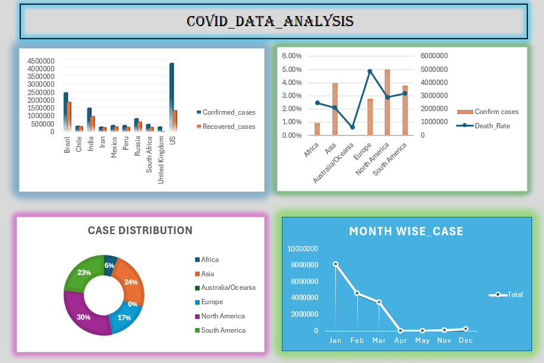

# COVID-19 Global Dashboard — Regional Pandemic Analysis using Excel

_Analyzing COVID-19 datasets to identify patterns in spread and recovery trends and communicating insights through interactive visualizations._

---

## 📑 Table of Contents
- [Dataset](#-dataset)
- [Dashboard](#-dashboard)
- [How to Run the Project](#-how-to-run-the-project)
- [Task Breakdown](#-task-breakdown)
- [Author & Contact](#-author--contact)

---

## 📂 Dataset
- **File Name:** `MINI PROJECT DATASET - WEEK 01.xlsx`
- The dataset is included directly in this repository.
- It contains global COVID-19 data used to build the dashboard.

> *No external data download is required.*

---

## 📊 Dashboard
The Excel dashboard provides insights through:

- ✔ Confirmed Cases vs Recovered Cases  
- 🌍 Continent-wise Case Distribution  
- 📈 Overall Case Distribution  
- 📅 Month-wise Case Trends  
- 🎛 Interactive filters and slicers  

### 📷 Dashboard Preview

---

## ▶ How to Run the Project
This is an **Excel-based project**, so no coding or execution is required.

1. Download or clone this GitHub repository
2. Open **`MINI PROJECT DATASET - WEEK 01.xlsx`**
3. Click **Enable Editing** (if prompted)
4. Use the dashboard filters and charts to explore COVID-19 trends

✔ Compatible with **Microsoft Excel 2016 or later**

---

## 🧩 Task Breakdown
This document explains the project objectives, workflow, and deliverables, dashboard creation, and analysis steps.

📄 **Project Documentation:**  
👉 [View Task Breakdown (PDF)](Task_Breakdown.pdf)

---

## 👤 Author & Contact
**Mayank Singh**  
📊 Data Analyst  
📧 Email: **mayanksingh4111999@gmail.com**

---

⭐ *If you find this project useful, feel free to star the repository!*

